class: inverse, center
background-image: url("img/darklight_RichardStrozynski.jpg")
background-size: contain


```{r options, echo = F}
hook_source <- knitr::knit_hooks$get('source')
knitr::knit_hooks$set(source = function(x, options) {
  x <- stringr::str_replace(x, "^[[:blank:]]?([^*].+?)[[:blank:]]*#<<[[:blank:]]*$", "*\\1")
  hook_source(x, options)
})

knitr::opts_chunk$set(
  echo = TRUE, 
  warning = FALSE, 
  message = FALSE, 
  collapse = TRUE,
  fig.height = 6.3,
  fig.allign = 'center',
  fig.retina = 3.5
)

options(width = 80)
```

<br><br>
## <span style='font-size:40pt;'>Effective Data Visualization</span><br><span style='font-size:25pt;color:#a7a7a7;font-weight:400;'>How to design impactful and aesthetically pleasing charts</span>
<br><br><br><br><br><br><br>
## <span style='font-size:24pt;'>Dr. Cédric Scherer</b><b style='font-size:18pt;color:#ccba56;font-weight:400;'><br>bespokeDS&nbsp;&nbsp;&nbsp;|&nbsp;&nbsp;&nbsp;September 28<sup>th</sup> 2020</b><br><p align='right;'><span style='font-size:9pt;color:#767676;font-weight:400;'></p>

---

<div id="content">
    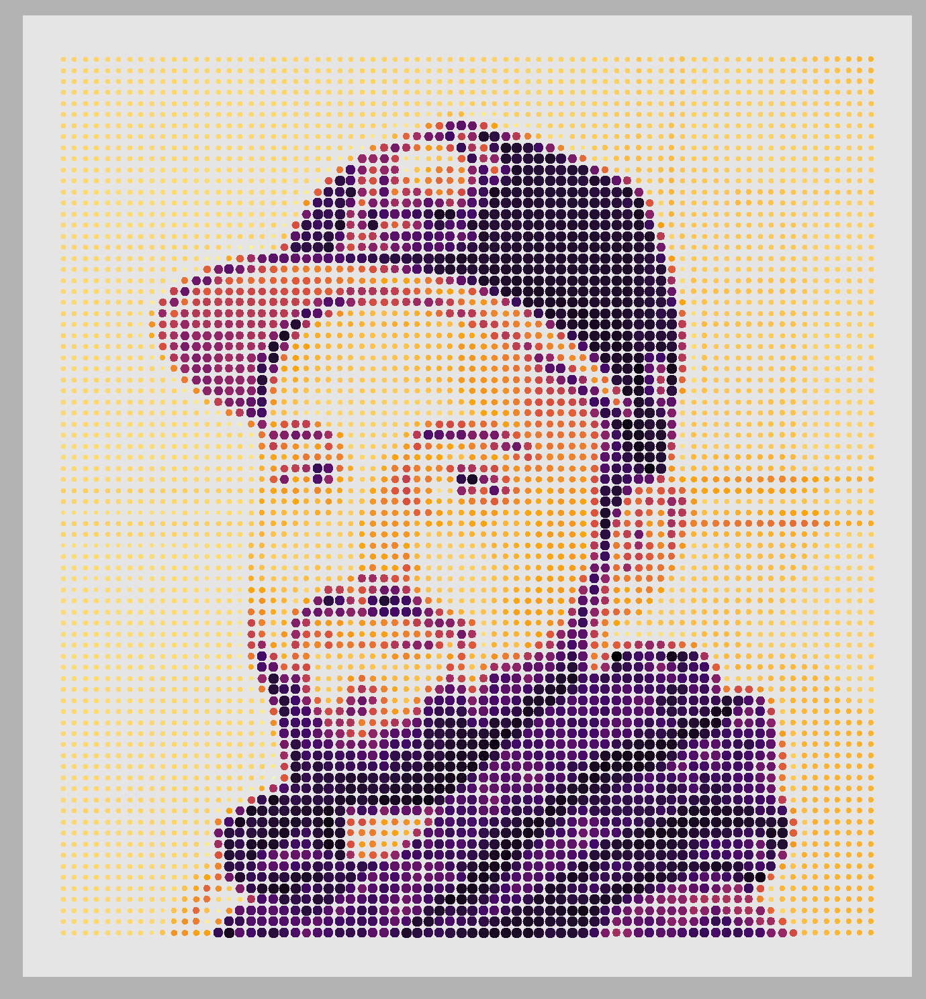
</div>
<br>
<b style='color:gray;font-family:montserrat;font-size:24pt;font-weight:bold;'>Scientist by 🎓</b>
<br>
<span style='font-size:13pt;'>&rarr;&nbsp;&nbsp;population and community dynamics, movement ecology, wildlife diseases</span>

* <b style='color:#28a87d;'>Ph.D. in <i>Ecology</i></b>

* <b style='color:#28a87d;'>PostDoc in <i>Computational Ecology</i></b><br>
<i style='font-size:12pt;color:grey;'>@&nbsp;&nbsp;Leibniz Insititute for Zoo and Wildlife Research (IZW)</i>

<br>
<b style='color:gray;font-family:montserrat;font-size:24pt;font-weight:bold;'>DataViz Designer by ❤️</b>
<br>
<span style='font-size:13pt;'>&rarr;&nbsp;&nbsp;analysist, designer, consultant, lecturer

* <b style='color:#28a87d;'>Freelancing Data Visualization Specialist</i></b><br>

  
* <b style='color:#28a87d;'>PostDoc in <i>Computational Ecology</i></b><br>

* <b style='color:#28a87d;'>Data Challenges and Personal Projects</i></b><br>
<i style='font-size:12pt;color:gray;'>#TidyTuesday, #30DayMapChallenge, #MakeoverMonday, #SWDchallenge</i>

---
class: center
background-image: url("img/rtidy2.png")
background-size: contain

#### &nbsp;&nbsp;&nbsp;&nbsp;&nbsp;&nbsp;&nbsp;&nbsp;&nbsp;&nbsp;&nbsp;&nbsp;&nbsp;&nbsp;&nbsp;&nbsp;&nbsp;&nbsp;&nbsp;&nbsp;&nbsp;&nbsp;&nbsp;&nbsp;&nbsp;&nbsp;&nbsp;&nbsp;&nbsp;&nbsp;&nbsp;&nbsp;&nbsp;&nbsp;&nbsp;&nbsp;&nbsp;&nbsp;&nbsp;&nbsp;&nbsp;&nbsp;&nbsp;Scientist by 🎓 DataViz Designer by ❤️ 

---
class: inverse, center

### Data Visualizations for Scientific Publications & Talks

.pull-left[
<br>
<p style='text-align:center;'><br><i style='color:lightgrey;font-size:10pt;'><i>Scherer et al. 2019 Journal of Animal Ecology</i></p>
]

.pull-right[
<br><br>
<p style='text-align:center;'><br><i style='color:lightgrey;font-size:10pt;'>Scherer et al. 2020 Oikos</i></p>
<p style='text-align:center;'><br><i style='color:lightgrey;font-size:10pt;'>Sciaini et al. 2019 Methods in Ecology & Evolution</i></p>
]

---
class: inverse, center

### Data Visualizations for Client Projects

.pull-left[
<p style='text-align:right;'></p>
<p style='text-align:right;'>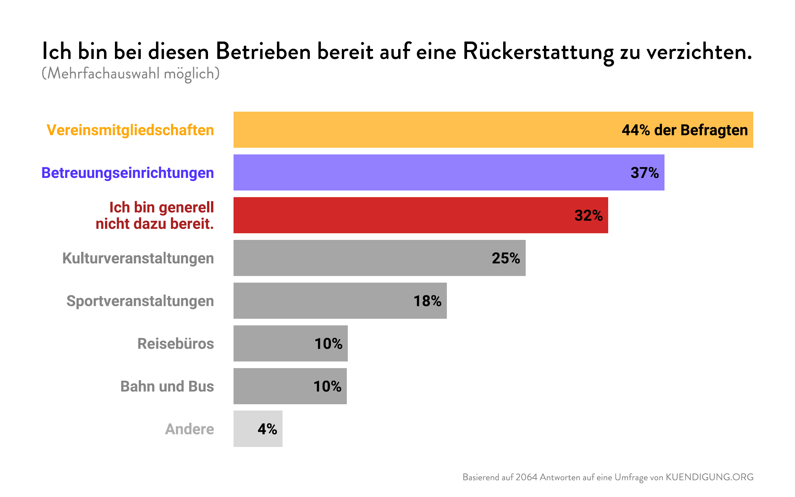</p>
]

.pull-right[
<p style='text-align:center;'></p>
<p style='text-align:center;'>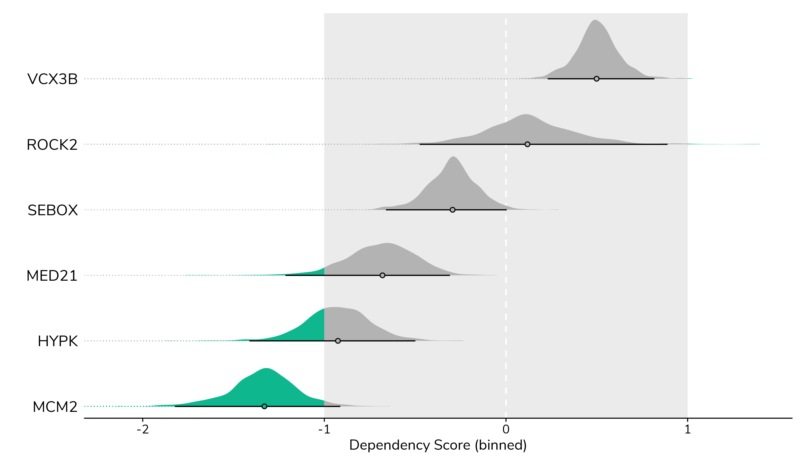</p>
]

---
class: inverse, center

### Data Visualizations as Challenge Contributions

.left-column[
<p style='text-align:center;'><br><i style='color:lightgrey;font-size:10pt;'>Contribution to #TidyTuesday</i></p>
]

.right-column[
<p style='text-align:center;'>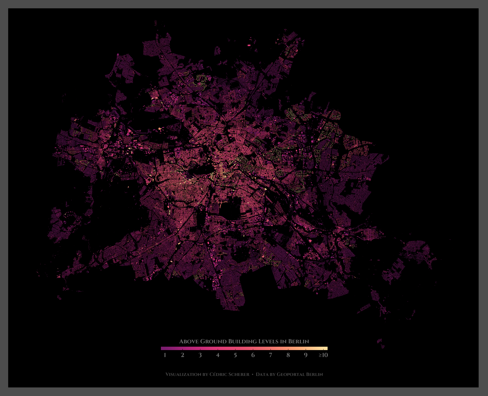<br><i style='color:lightgrey;font-size:10pt;'>Contribution to #30DaymapChallenge</i></p>
]

---
class: inverse, center, middle

# <b style='font-size:70pt;color:#ebc500;'>Data Visualization</span></b><br><b style='font-size:40pt;'>is any graphical representation<br>of information and data.</b></span>
<i style='font-size:15pt;color:grey;'><br>&nbsp;</i><br><br><br>


---
class: inverse, center, middle

# <b style='font-size:70pt;color:#ebc500;'>Data Visualization</span></b><br><b style='font-size:40pt;'>is part art and part science.<br>&nbsp;</b></span>
<i style='font-size:15pt;color:grey;'><br>Claus O. Wilke, "Fundamentals of Data Visualization"</i><br><br><br>

---
class: inverse, right, bottom
background-image: url("img/dataviz-google.jpg")
background-size: cover

<p style='font-size:12pt;color:white;'><i><a style='color:#4F8ACC;' href="https://www.bial-r.com/2020/01/21/dataviz-quelle-valeur-ajoutee-pour-un-projet-big-data/">bial-r.com</a></i></p> 

---
class: top, center
background-image: url("img/a_view_on_despair_cut.jpg")
background-size: contain

<p style='font-size:12pt;color:white;'><i><a style='color:#ebc500;' href="https://www.studioterp.nl/a-view-on-despair-a-datavisualization-project-by-studio-terp/">A View on Despair</a> by Sonja Kuijpers/STUDIO TERP</i></p> 

---

.pull-left[
<p style='text-align:center;'><br>
<i style='font-size:11pt;color:grey;'><a href="https://www.studioterp.nl/a-view-on-despair-a-datavisualization-project-by-studio-terp/">A View on Despair</a> by Sonja Kuijpers/STUDIO TERP
</i></p>
]

.pull-right[
<b style='color:#000000;'>Each element represents a person who<br>committed suicide in the Netherlands in 2017.</b>
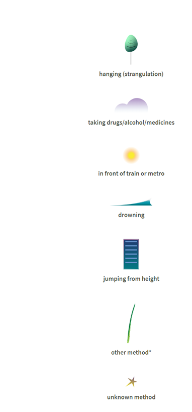
]

---
class: bottom, center
background-image: url("img/1200px-Minard.png")
background-size: contain

<p style='font-size:12pt;color:grey;'><i><a style='color:#ebc500;' href="https://en.wikipedia.org/wiki/Charles_Joseph_Minard#The_map_of_Napoleon%27s_Russian_campaign">Carte figurative des pertes successives en hommes de l'Armée Française dans la campagne de Russie 1812–1813</a> by Charles Joseph Minard
</i></p>

---

<p style='text-align:center;'>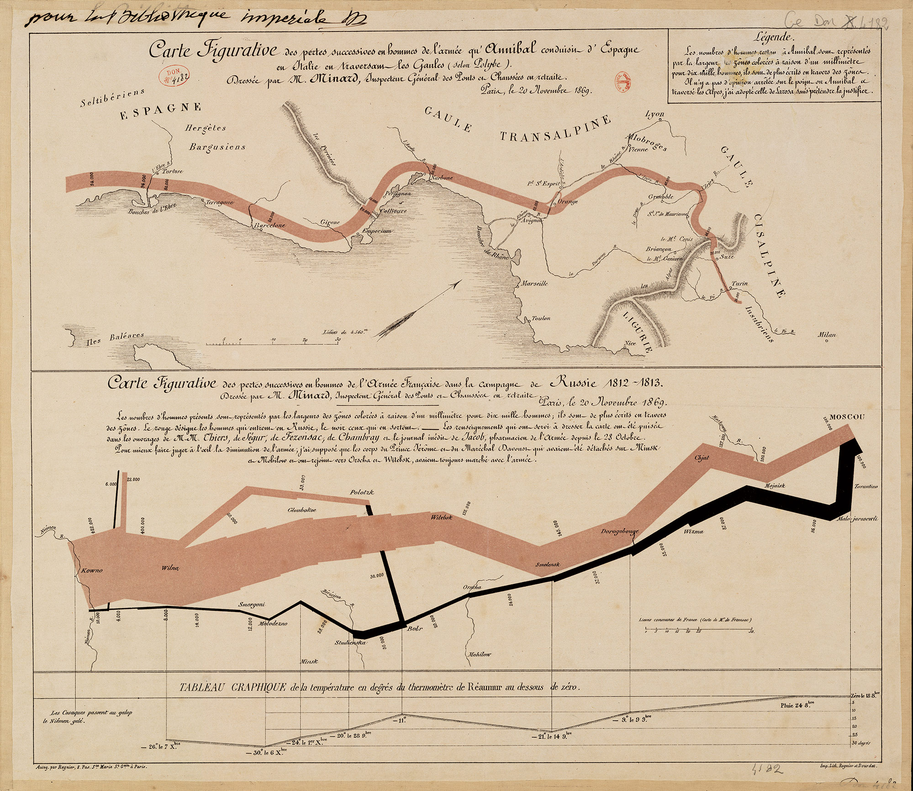<br>
<i style='font-size:10pt;color:grey;'><a href="https://en.wikipedia.org/wiki/Charles_Joseph_Minard#The_map_of_Napoleon%27s_Russian_campaign">Carte figurative des pertes successives en hommes de l'Armée Française dans la campagne de Russie 1812–1813</a> and<br><a href="https://patrimoine.enpc.fr/document/ENPC01_Fol_10975?image=54#bibnum">Carte figurative des pertes successives en hommes de l'Armée qu'Annibal conduisit d'Espagne en Italie en traversant les Gaules (selon Polybe)</a> by Charles Joseph Minard
</i></p>

<ul style='line-height:2;margin-left:120px;'>
  <li>displays the progress of the troops of Hannibal (218 BC) and Napoleon (1812-1813) in the form of a stream </li>
  <li>often considered as the <b>best statistical graphic ever drawn</b>&nbsp;&nbsp;</li>
</ul>

---

# <p style='text-align:center;'><b>What Makes It a<br><span style='color:#D1AF07;'>Bad Data Visualization</span></b></p>

<p style='font-size:28pt;margin-left:250px;line-height:2.3;color:grey;'>
<b style='color:#D1AF07;'>&rarr;&nbsp;&nbsp;aesthetic problems</b>&nbsp;&nbsp;(bad design)<br>
<b style='color:#D1AF07;'>&rarr;&nbsp;&nbsp;substantive problems</b>&nbsp;&nbsp;(bad data)<br>
<b style='color:#D1AF07;'>&rarr;&nbsp;&nbsp;perceptual problems</b>&nbsp;&nbsp;(bad perception)
</p>

---

# <p style='text-align:center;'><b>How to Create an Eye for<br><span style='color:#28a87d;'>Good Data Visualization</span></b></p>

<p style='font-size:28pt;margin-left:310px;line-height:2.3;color:grey;'>
<b style='color:#28a87d;'>&rarr;&nbsp;&nbsp;Information</b>&nbsp;&nbsp;(Integrity)
<br><b style='color:#28a87d;'>&rarr;&nbsp;&nbsp;Story</b>&nbsp;&nbsp;(Interestingness)
<br><b style='color:#28a87d;'>&rarr;&nbsp;&nbsp;Goal</b>&nbsp;&nbsp;(Usefulness)
<br><b style='color:#28a87d;'>&rarr;&nbsp;&nbsp;Visual Form</b>&nbsp;&nbsp;(Beauty)
</p>

---
background-image: url("img/good_vs_bad2.jpg")
background-size: cover

---
class: inverse, center, middle

# <b style='font-size:100pt;color:#ebc500;font-family:bebas neue;'>Information</span></b><br>
# <i style='font-size:30pt;font-family:bitter;'>Understand your data and be accurate</i><br><br>

---
class: center, middle

<style>
.left-column { width:26%; }
.right-column { width:67%; }
</style>

.left-column[
  <br><br><br><br>
  
]
.right-column[
  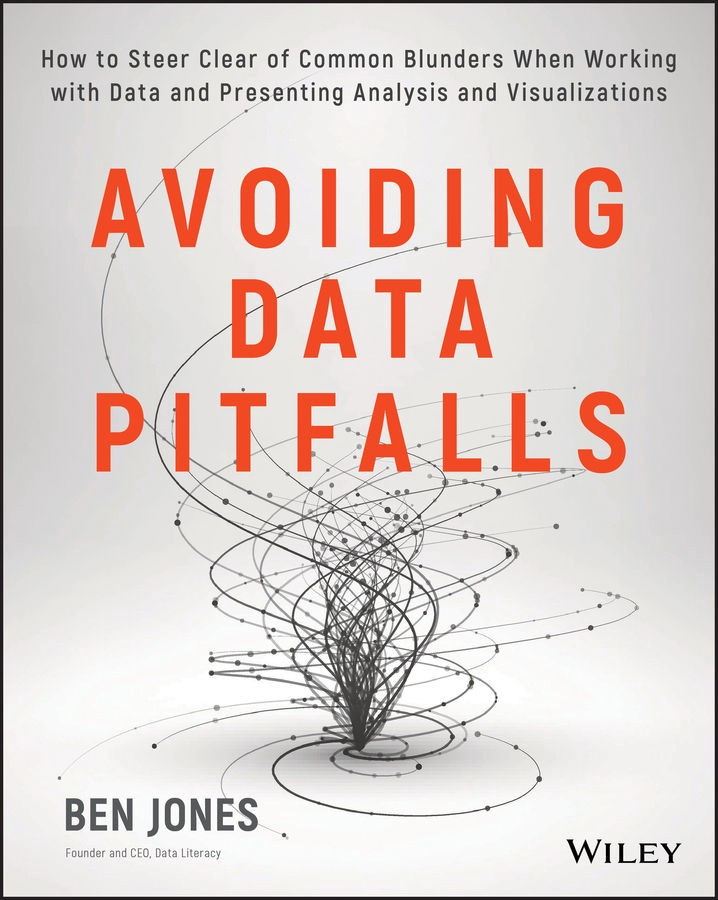
]

---
class: center, middle

<b style='font-size:50pt;color:#28a87d;line-height:1;font-family:montserrat;'>Our data is never a perfect<br>reflection of the real world.</b>

???

&rarr;Not crime but <i>reported</i> crime
&rarr;Collected by humans: guesstimation, precision and errors
&rarr;Collected by machines: precision and errors

---
class: inverse, center, middle

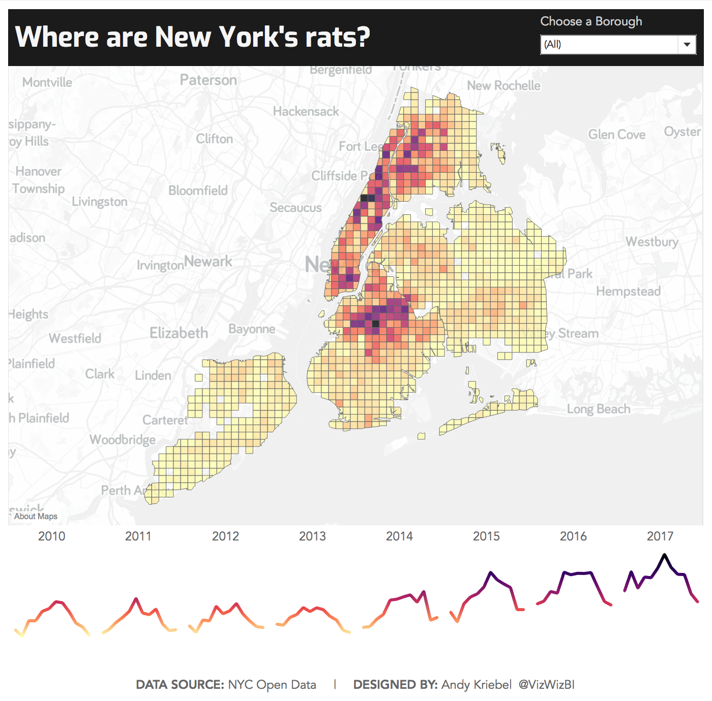

---
class: inverse, center, middle

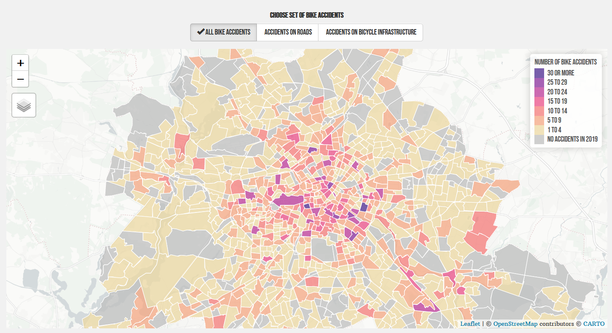

---
class: center, middle

<b style='font-size:50pt;color:#28a87d;line-height:1;font-family:montserrat;'>The best use of data is to teach us what <i>isn't true</i>.</b>

???

We form singular statements first, but shouldn't convert it to universal statements.
Instead, confront yourself with a falsifiable universal statement and attemp to disprove it.

---
class: left, bottom
background-image:url("img/black_swan.png")
background-size: cover

<span style='font-size:10pt;font-color:lightgray;'>Source: inhomelandsecurity.com/risk-management-and-black-swan-events</span>

???

&rarr; "The swan is white" (singular statement)
&rarr; "All swans are white" (universal statement)

---
class: inverse, center, middle

# <b style='font-size:100pt;color:#ebc500;font-family:bebas neue;'>Story</span></b><br>
# <i style='font-size:30pt;font-family:bitter;'>Be clear about the story of your visualization</i><br><br>

---
class: middle, center

<b style='font-size:28pt;color:#28a87d;line-height:2.5;font-family:montserrat;'>
Who is my audience?<br>
What am I trying to achieve with the visualization?
</b>

---
class: inverse, middle, center

  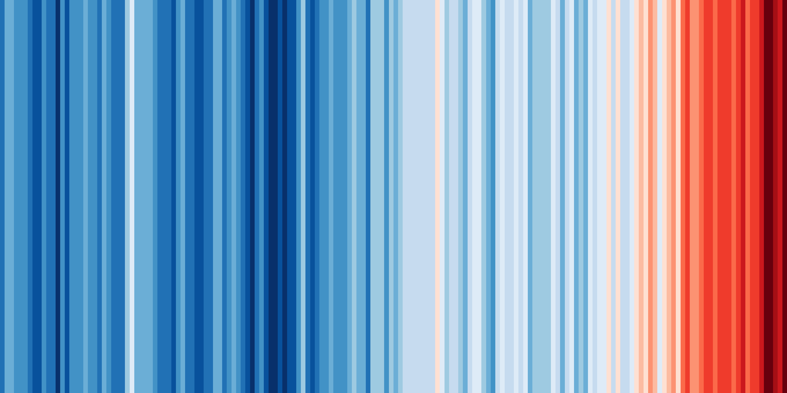<br><i style='font-size:11pt;color:grey;'><a style='color:#ebc500;' href="https://showyourstripes.info/">Warming Stripes</a> by Ed Hawkins</i>

---
class: inverse, middle, center

  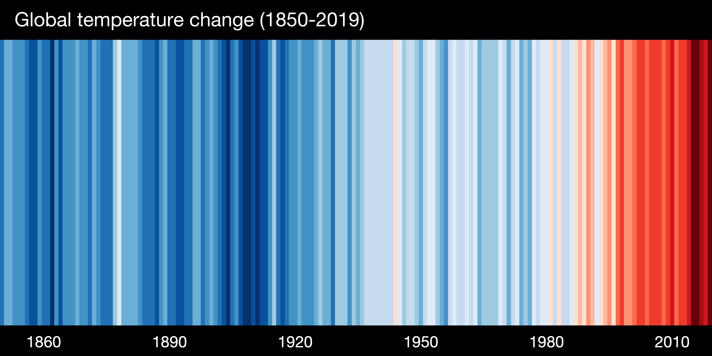<br><i style='font-size:11pt;color:grey;'><a style='color:#ebc500;' href="https://showyourstripes.info/">Warming Stripes</a> by Ed Hawkins</i>

---
class: inverse, middle, center

  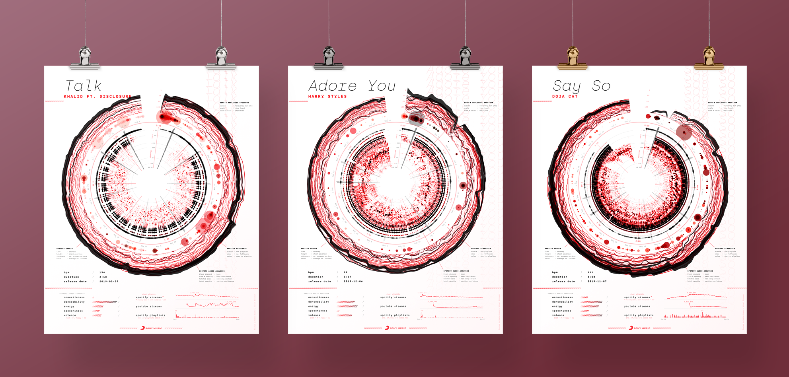<br><i style='font-size:11pt;color:grey;'><a style='color:#ebc500;' href="https://www.visualcinnamon.com/2020/06/sony-music-data-art">Sony Music Song Posters</a> by Nadieh Bremer</i>

---
class: inverse, middle, center

.pull-left[
  <br><br>
  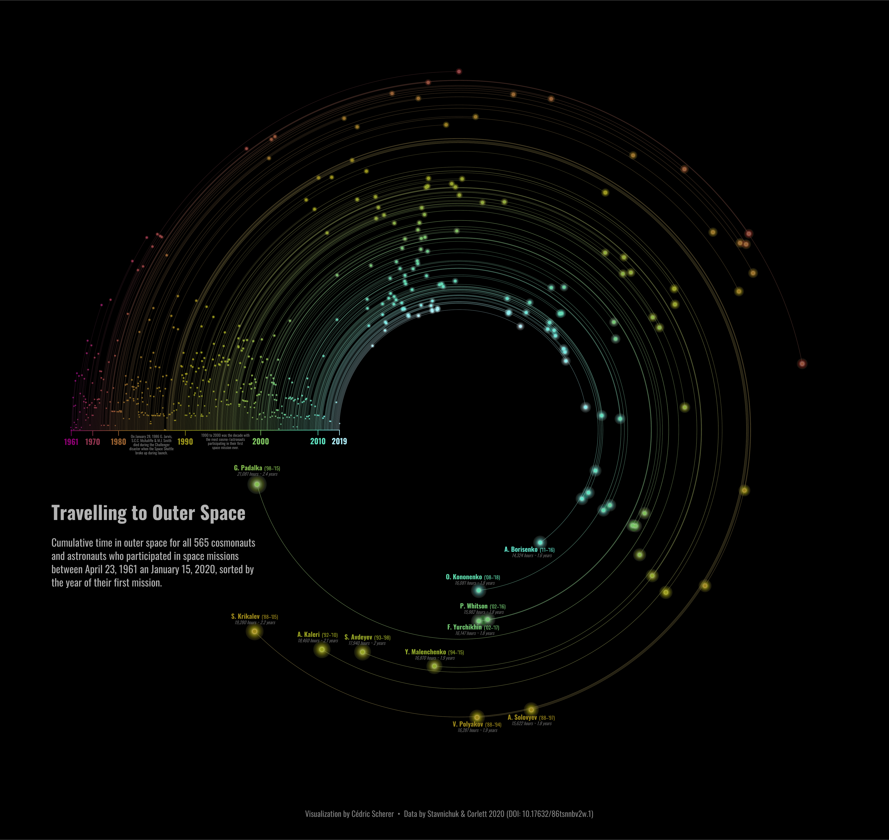
]
.pull-right[
  
]

---
class: inverse, middle, center

.pull-left[
  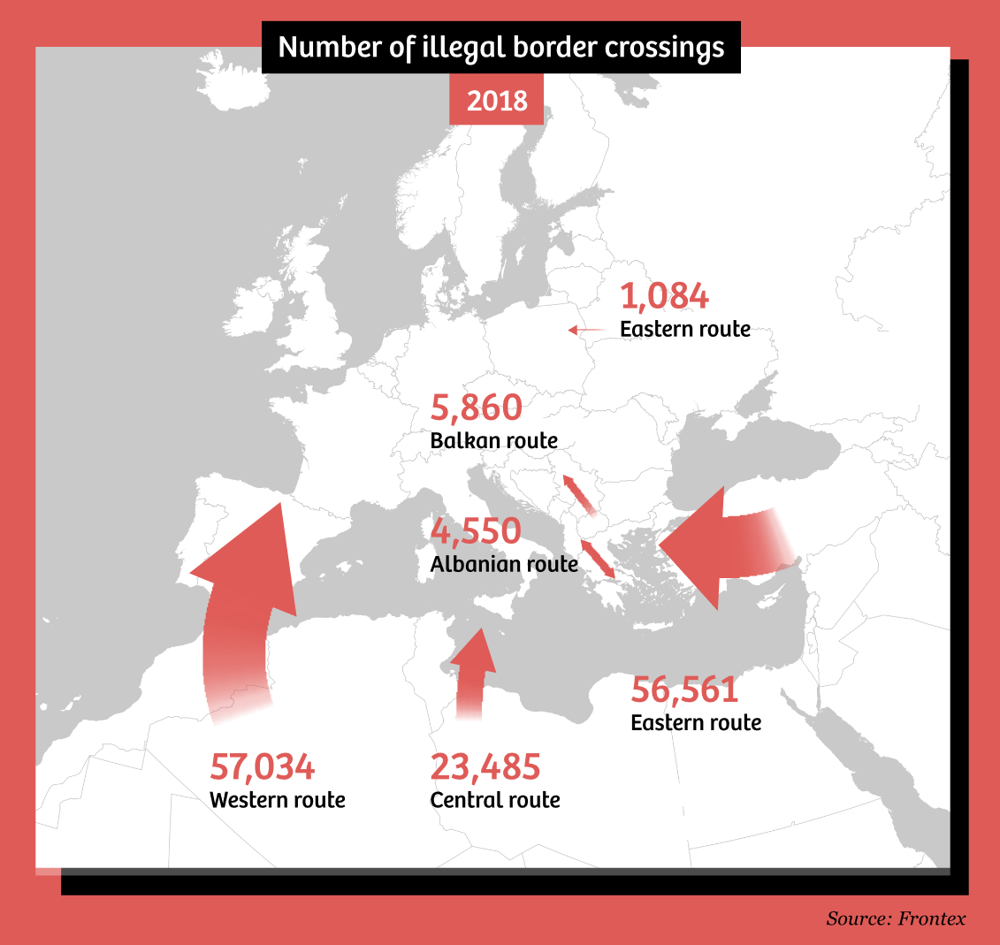
]

.pull-right[
  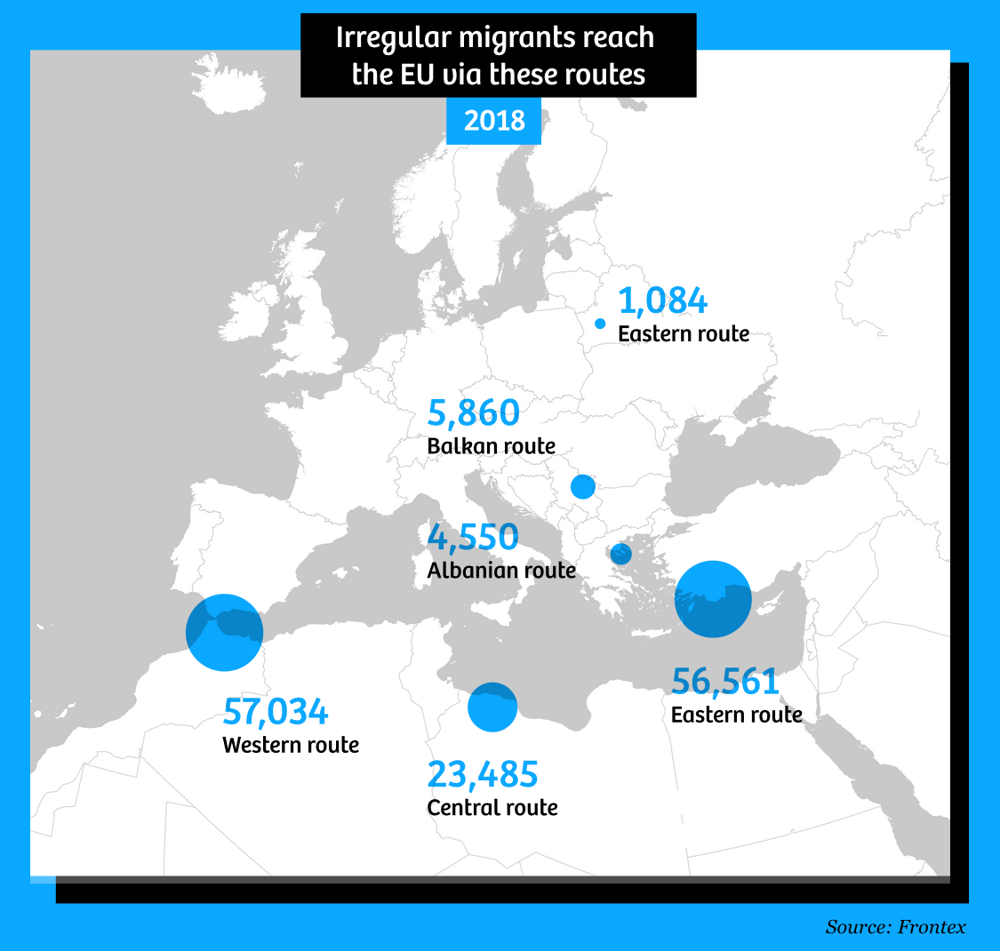
]
  
<i style='font-size:11pt;color:grey;'><a style='color:#ebc500;' href="https://thecorrespondent.com/664/how-maps-in-the-media-make-us-more-negative-about-migrants/738023272448-bac255ba">How maps in the media make us more negative about migrants</a> by Maite Vermeulen, Leon de Korte & Henk van Houtum </i>

---
class: inverse, middle, center

.pull-left[
  
]

.pull-right[
  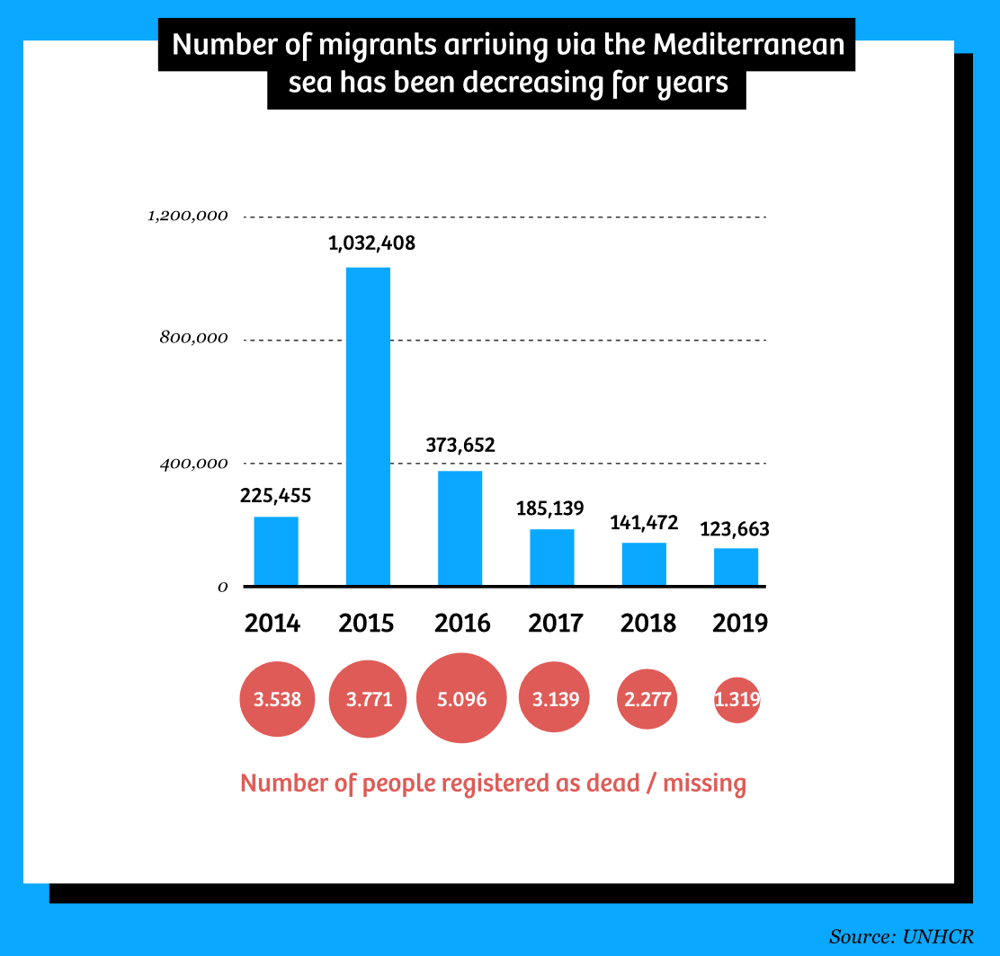
]
  
<i style='font-size:11pt;color:grey;'><a style='color:#ebc500;' href="https://thecorrespondent.com/664/how-maps-in-the-media-make-us-more-negative-about-migrants/738023272448-bac255ba">How maps in the media make us more negative about migrants</a> by Maite Vermeulen, Leon de Korte & Henk van Houtum </i>

---
class: inverse, middle, center

.pull-left[
  
]

.pull-right[
  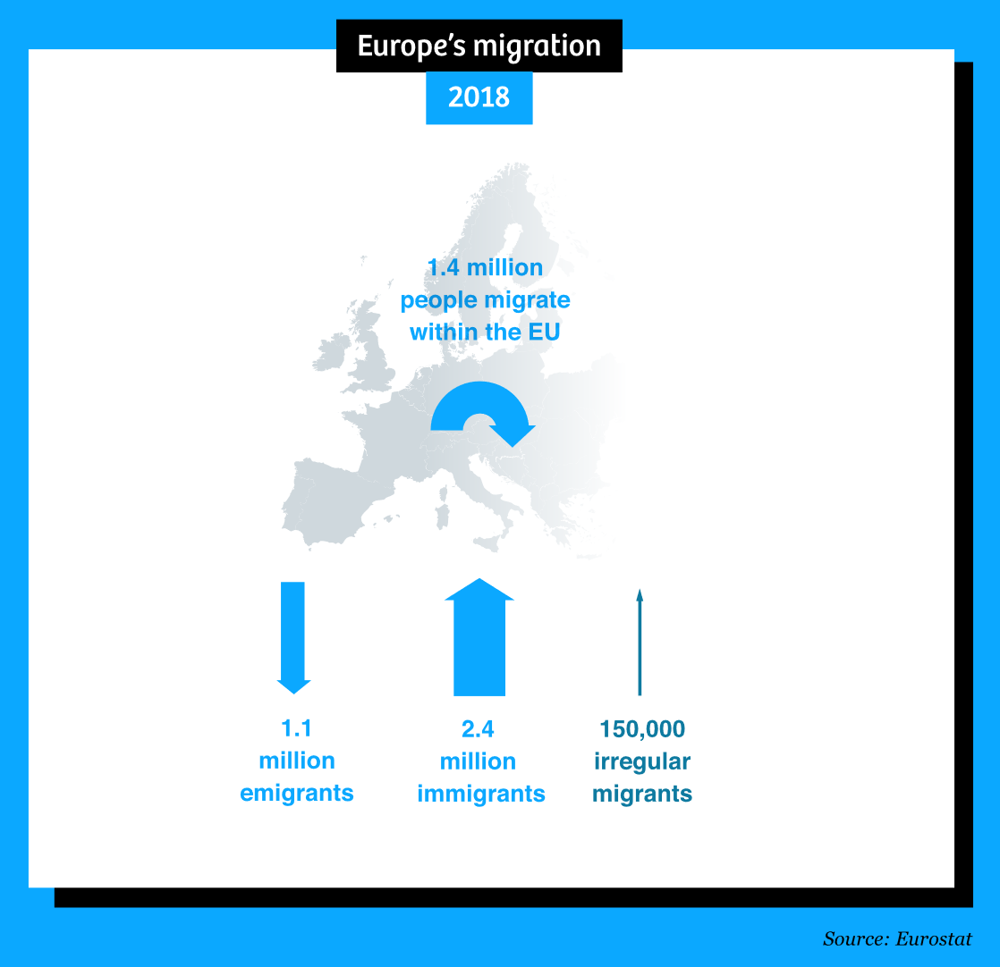
]
  
<i style='font-size:11pt;color:grey;'><a style='color:#ebc500;' href="https://thecorrespondent.com/664/how-maps-in-the-media-make-us-more-negative-about-migrants/738023272448-bac255ba">How maps in the media make us more negative about migrants</a> by Maite Vermeulen, Leon de Korte & Henk van Houtum </i> s

---
class: inverse, center, middle

# <b style='font-size:100pt;color:#ebc500;font-family:bebas neue;'>Goal</span></b><br>
# <i style='font-size:30pt;font-family:bitter;'>Select charts that successfully transport your story</i><br><br>

---
class: center

## <b style='color:#28a87d;'>Data visualizations map values into quantifiable features <span style='color:#b3b3b3;'>(aesthetics)</span></b>


<br><br><i style='font-size:11pt;color:grey;'><a href="https://paldhous.github.io/ucb/2019/dataviz/week2.html">Peter Aldhous</a> based on <a href="https://courses.ischool.berkeley.edu/i247/f05/readings/Cleveland_GraphicalPerception_Science85.pdf">experiments by William Cleveland and Robert McGill</a></i>

---

.pull-left[
  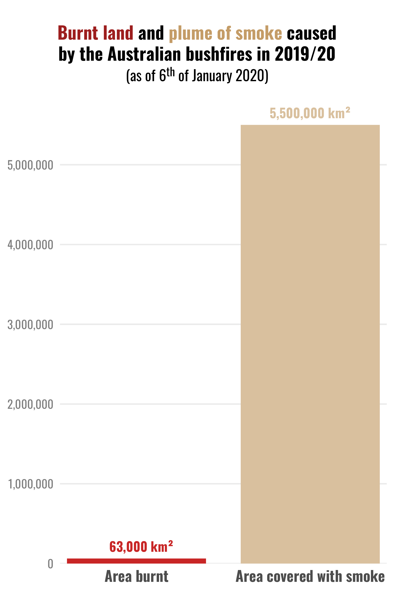
]

.pull-right[]

---

.pull-left[
  
]

.pull-right[
  <br><br><br>
  
]

---

<ass: inverse, center, middle


---
background-image: url("img/chart-choice-helpers.png")
background-size: contain

---
class: inverse, center, middle

# <b style='font-size:100pt;color:#ebc500;font-family:bebas neue;'>Visual Form</span></b><br>
# <i style='font-size:30pt;font-family:bitter;'>Follow design rules and data visualization principles</i><br><br>

---
class: center, middle

# <b style='font-size:70pt;color:#28a87d;'>Colors</span></b><br>
# <b style='font-size:40pt;'>and Common Pitfalls</b><br><br><br>

---
class: center

## Color Palette Types
<br><br>


---
class: center

## Color Choice & Accessibility

<br><br>
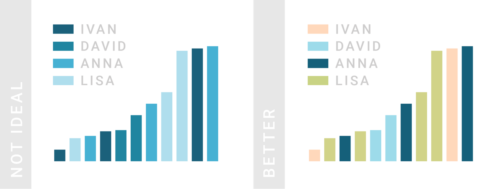<br><i style='font-size:13pt;color:grey;'><br><a href="https://blog.datawrapper.de/colors/">What to consider when choosing colors for data visualization</a> by Lisa Charlotte Rost/DataWrapper</i>

---
class: center

## Color Choice & Accessibility

<br><br>
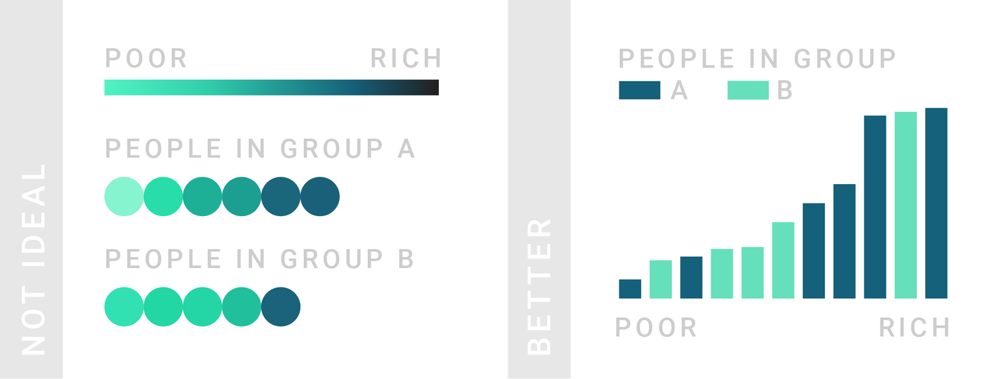<br><i style='font-size:13pt;color:grey;'><br><a href="https://blog.datawrapper.de/colors/">What to consider when choosing colors for data visualization</a> by Lisa Charlotte Rost/DataWrapper</i>

---
class: center

## Color Choice & Accessibility

<br><br>
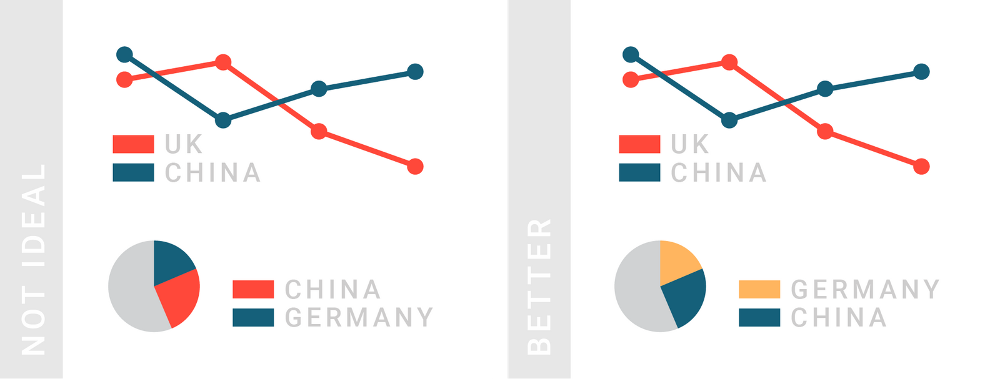<br><i style='font-size:13pt;color:grey;'><br><a href="https://blog.datawrapper.de/colors/">What to consider when choosing colors for data visualization</a> by Lisa Charlotte Rost/DataWrapper</i>

---
class: center, middle


---
class: center, middle


---
class: center, middle

<br><i style='font-size:11pt;color:grey;'>Source: eagereyes.org/basicss/rainbow-color-map</i>

---
class: center, middle

<br><i style='font-size:11pt;color:grey;'>Modified from eagereyes.org/basicss/rainbow-color-map</i>

---
class: center, middle

<br><i style='font-size:11pt;color:grey;'>Source: fabiocrameri.ch/batlow</i>

---
class: center, middle

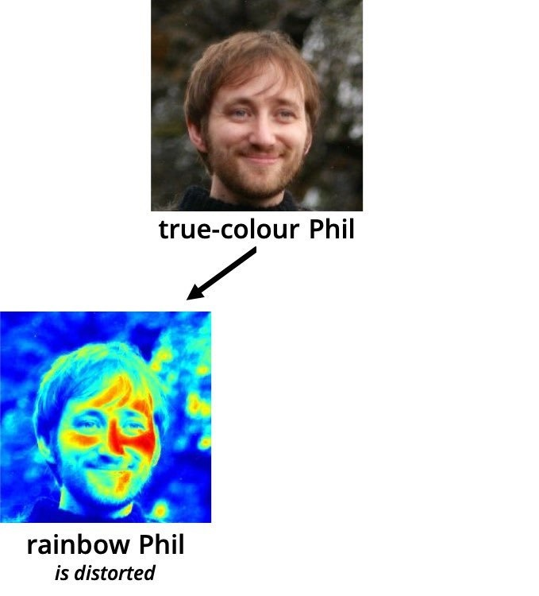<br><i style='font-size:11pt;color:grey;'>Source: fabiocrameri.ch/batlow</i>

---
class: center, middle

<br><i style='font-size:11pt;color:grey;'>Source: fabiocrameri.ch/batlow</i>

---
class: center

## Color Choice & Accessibility

<br><br>
<b style='font-size:24pt;color:#7c7c7c;'>
Choose color-blind friendly palettes:<br><a href="https://projects.susielu.com/viz-palette">projects.susielu.com/viz-palette</a>
<br><br>
Test your final visualization:<br><a href="https://color-blindness.com/coblis-color-blindness-simulator">color-blindness.com/coblis-color-blindness-simulator</a>
<br><br>
Create a CVD-version of your ggplot in R:<br><a href="https://github.com/clauswilke/colorblindr">github.com/clauswilke/colorblindr</a>
</b>

???

To make sure your visualizations work for people<br>with CVD don’t just rely on provided color palettes.  
Instead, test your figures in a color-blindness simulator!


---
class: center

## Color Choice & Accessibility

<br><a style='font-size:13pt;' href="https://projects.susielu.com/viz-palette">projects.susielu.com/viz-palette</a>

---
class: right, bottom
background-image: url("img/typography.png")
background-size: cover

# <b style='font-size:52pt;color:#ebc500;'>Typography</span></b><br><br>&nbsp;

---
background-image: url("img/fontsmatter.jpg")
background-size: cover

---
class: center

## The Choice of the <span style='color:#28a87d;'>Font(s)</span>

<ul style='text-align:left;font-size:23pt;'>
<li> The font(s) should fit the topic and audience - <b>context matters</b>.</li><br>

<li> <b>Avoid fancy</b> fonts and squiggeled letters.</li><br>

<li> Use ways to <b>visualize hierarchy</b>.</li><br>

<li> Avoid using <b>ALL CAPS</b>.</li><br>

<li> Use a <b>monospaced</b> font with lining for numbers.</li><br>
</ul>

---
class: center

## The Choice of the <span style='color:#28a87d;'>Font(s)</span>

<ul style='text-align:left;font-size:23pt;'>
<li> The font(s) should fit the topic and audience - <b>context matters</b>.</li><br>

<li> <b>Avoid fancy</b> fonts and squiggeled letters.</li><br>

<li> Use ways to <b>visualize hierarchy</b>.</li><br>

<li> Avoid using <b>ALL CAPS</b>.</li><br>

<li> Use a <b>monospaced</b> font with lining for numbers.</li><br>

<li> <b style='color:#28a87d;'>Consistency is key!</b></li>
</ul>

---
class: center

## How to Visualize <span style='color:#28a87d;'>Hierarchy</span>
<br>
<span style='color:#7c7c7c;font-size:90pt;'>I am important!</span><br><br><br>
<span style='color:#7c7c7c;font-size:40pt;'>I am important, too!</span><br><br><br>
<span style='color:#7c7c7c;font-size:20pt;'>Oh, hi there. Thanks for reading me...</span><br><br><br>
<span style='color:#7c7c7c;font-size:11pt;'>Yeah, I know I am kinda boring. Sorry.</span>

---
class: center

## How to Visualize <span style='color:#28a87d;'>Hierarchy</span>
<br><br>
<u style='color:#7c7c7c;font-size:35pt;font-weight:bolder;'>I am important!</u><br><br>
<span style='color:#7c7c7c;font-size:35pt;font-weight:bold;'>I am important, too!</span><br><br>
<i style='color:#7c7c7c;font-size:35pt;'>Oh, hi there. Thanks for reading me...</i><br><br>
<span style='color:#7c7c7c;font-size:35pt;'>Yeah, I know I am kinda boring. Sorry.</span>

---
class: center

## How to Visualize <span style='color:#28a87d;'>Hierarchy</span>
<br><br>
<span style='color:#eb5d00;font-size:35pt;'>I am important!</span><br><br>
<span style='color:#000000;font-size:35pt;'>I am important, too!</span><br><br>
<span style='color:#adadad;font-size:35pt;'>Oh, hi there. Thanks for reading me...</span><br><br>
<span style='color:#d4d4d4;font-size:35pt;'>Yeah, I know I am kinda boring. Sorry.</span>

---
class: center

## How to Visualize <span style='color:#28a87d;'>Hierarchy</span>
<br><br>
<span style='color:#7c7c7c;font-size:30pt;'>I am important!</span><br>
<span style='color:#7c7c7c;font-size:30pt;'>I am important, too!</span><br><br><br><br>
<span style='color:#7c7c7c;font-size:30pt;'>Oh, hi there. Thanks for reading me...</span><br>
<span style='color:#7c7c7c;font-size:30pt;'>Yeah, I know I am kinda boring. Sorry.</span>

---
class: center

## How to Visualize <span style='color:#28a87d;'>Hierarchy</span>
<br><br><br><br>
<span style='color:#7c7c7c;font-family:poppins;font-size:30pt;'>I am important!</span><br>
<span style='color:#7c7c7c;font-family:poppins;font-size:30pt;'>I am important, too!</span><br><br><br>
<span style='color:#7c7c7c;font-family:merriweather;font-size:27pt;'>Oh, hi there. Thanks for reading me...<br>Yeah, I know I am kinda boring. Sorry.</span><br>

---
class: center

## How to Visualize <span style='color:#28a87d;'>Hierarchy</span>
<br><br><br><br>
<b style='color:#000000;font-family:poppins;font-size:35pt;'>I am important!</b><br>
<span style='color:#000000;font-family:poppins;font-size:22pt;'>I am important, too!</span><br><br><br>
<span style='color:#7c7c7c;font-family:merriweather;font-size:17pt;'>Oh, hi there. Thanks for reading me...<br>Yeah, I know I am kinda boring. Sorry.</span><br>

---
class: center

## How to Visualize <span style='color:#28a87d;'>Hierarchy</span>
<br><br><br><br>
<b style='color:#000000;font-family:poppins;font-size:35pt;'>I am important!</b><br>
<b style='color:#eb5d00;font-family:merriweather;font-size:22pt;'>I am important, too.</b><br><br><br>
<span style='color:#7c7c7c;font-family:merriweather;font-7ze:18pt;'>Oh, hi there. Thanks for reading me...<br>Yeah, I know I am kinda boring. Sorry.</span><br>

---
class: center

## Keep it <span style='color:#28a87d;'>Simple</span></span>

<br>
<br><i style='font-size:11pt;color:grey;'>Source: canva.com</i>

---
class: center

# The `1Il` Test


---
class: center
 
## <span style='color:#28a87d;'>Tabular (Monospaced) Numbers</span>

<br><br>
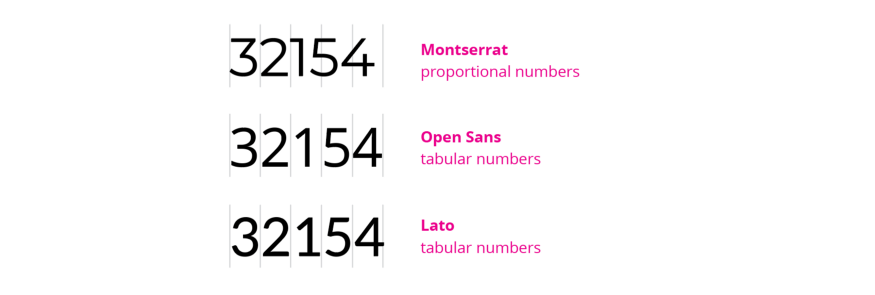<br><i style='font-size:11pt;color:grey;'>Source: Tiffany France on Medium.com</i>

---

## <span style='color:#28a87d;'>Allign</span> Your Text

<style>
.left-column { width:36%; }
.right-column { width:57%; }
</style>

.left-column[
<br><br>
<ul style='font-weight:bold;font-size:18pt;'>
  <li>Left-align most text<br><br><br></li>
  <li>Title should be left alligned<br><br><br></li>
  <li>Labels and subtitles can be<br>center or right alligned</li>
</ul>
]

.right-column[
  <br><i style='font-size:10pt;color:grey;'>Source: Will R. Chase</i>
]

---

## <span style='color:#28a87d;'>(Don't) Rotate</span> Your Text

<br>
.pull-left[
  <p style='text-align:center;'>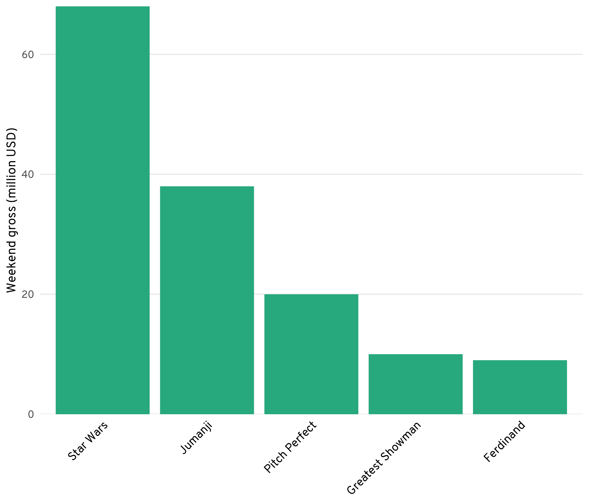</p>
]

.pull-right[
  <p style='text-align:center;'>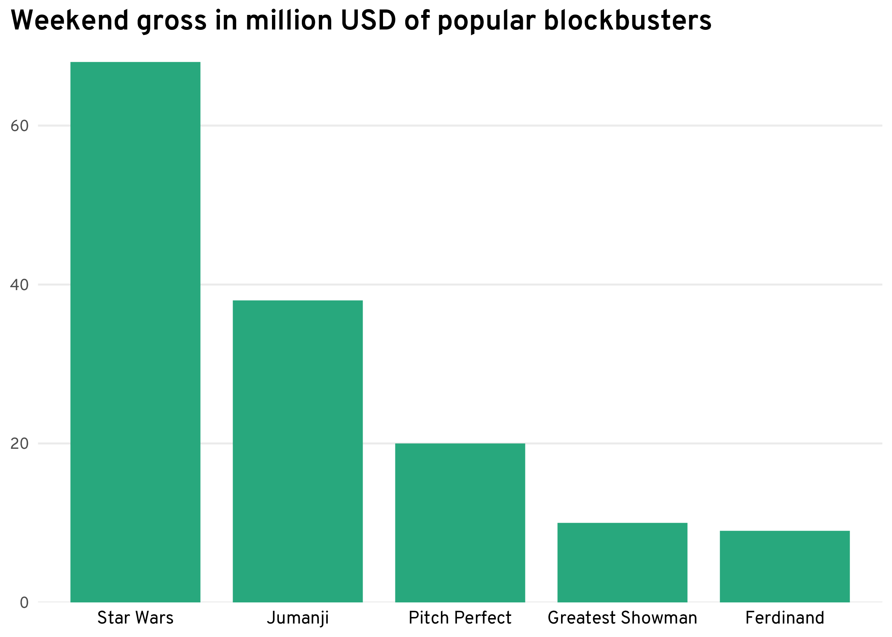</p>
]

<p style='text-align:center;'><i style='font-size:11pt;color:grey;'>Modified from  <a href="https://clauswilke.com/dataviz/">Fundamentals of Data Visualization</a> by Claus Wilke</i></p>

---

## <span style='color:#28a87d;'>(Don't) Rotate</span> Your Text

<br>
.pull-left[
  <p style='text-align:center;'></p>
]

.pull-right[
  <p style='text-align:center;'>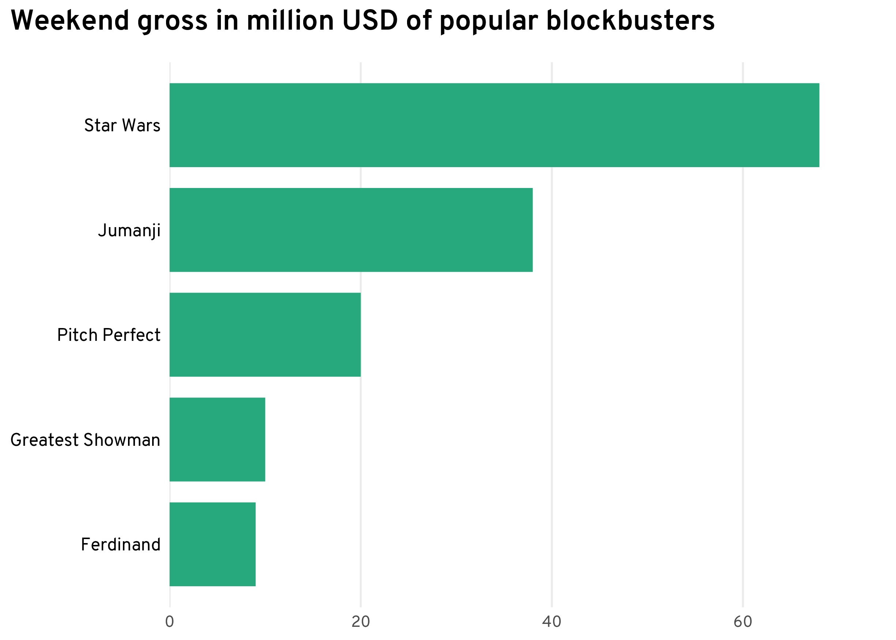</p>
]

<p style='text-align:center;'>&nbsp;</p>

---

## Use <span style='color:#28a87d;'>Annotations</span>

<br>
.pull-left[
  <p style='text-align:center;'></p>
]

.pull-right[
  <p style='text-align:center;'>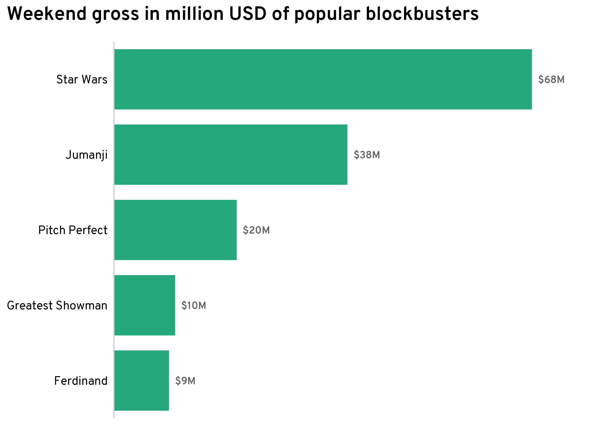</p>
]

---

## Use <span style='color:#28a87d;'>Annotations</span>

<br>
.pull-left[
  <p style='text-align:center;'></p>
]

.pull-right[
  <p style='text-align:center;'>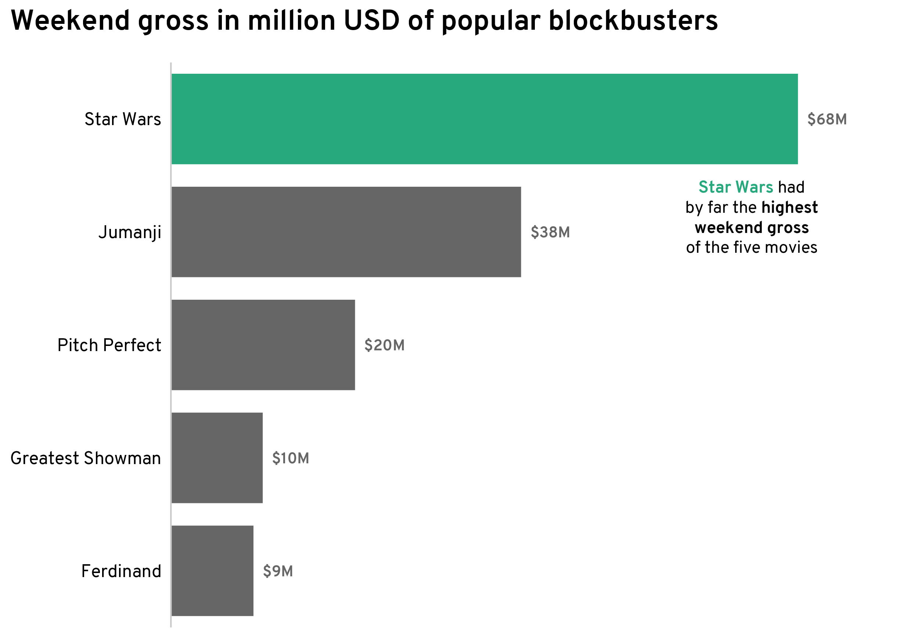</p>
]

---
class: inverse, center

.pull-left[
<p style='text-align:center;'>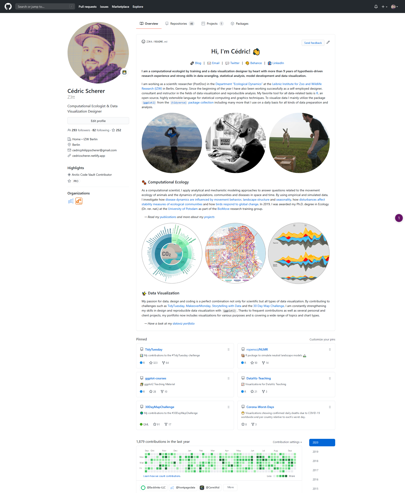<br>
<b style='font-size:13pt;color:grey;'><a href="https://github.com/Z3tt">github.com/Z3tt</a></b>
]

.pull-right[
<p style='text-align:center;'>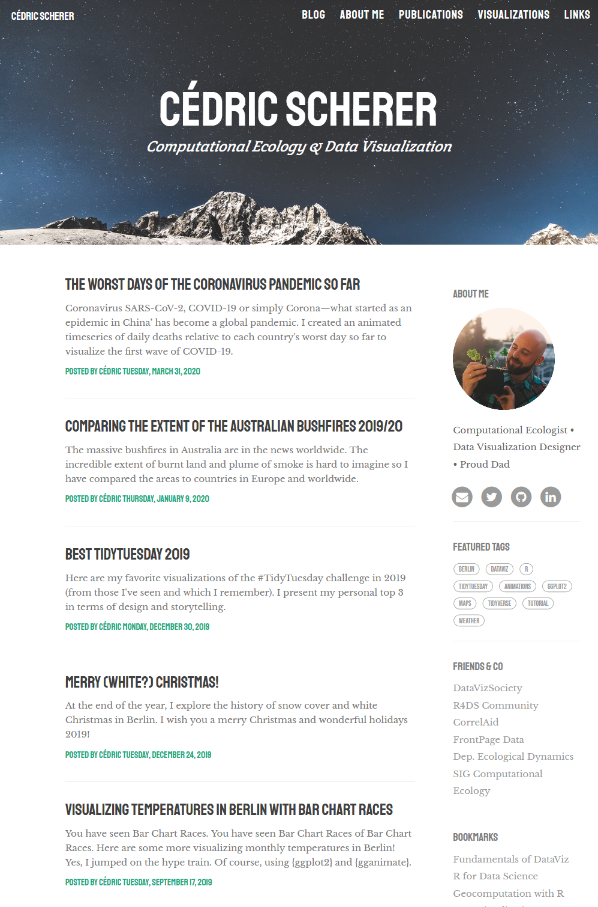<br>
<b style='font-size:13pt;color:grey;'><a href="https://cedricscherer.netlify.com">cedricscherer.netlify.com</a></b>
]

---
class: inverse, center

.pull-left[
<p style='text-align:center;'>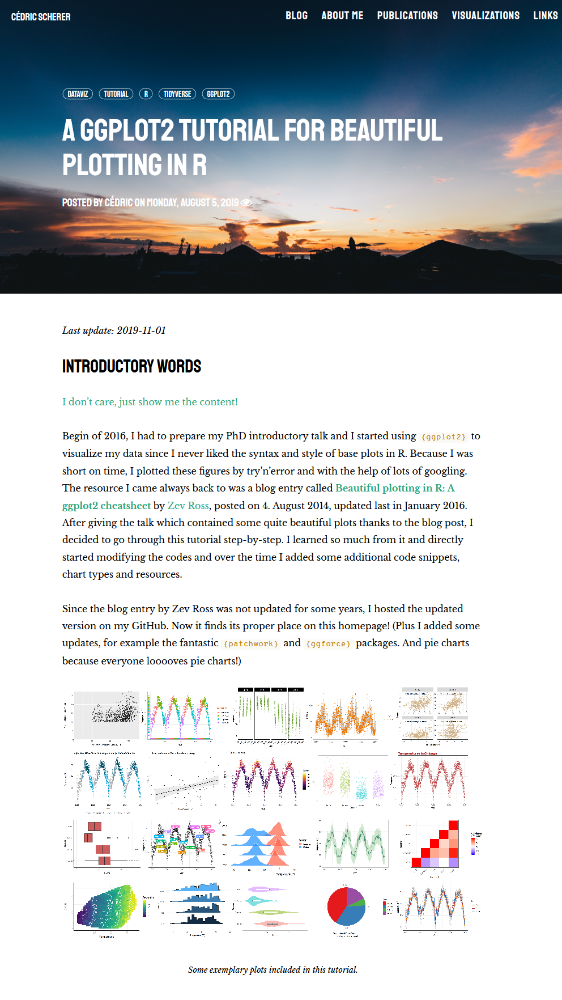</p>
]

.pull-right[
<p style='text-align:center;'>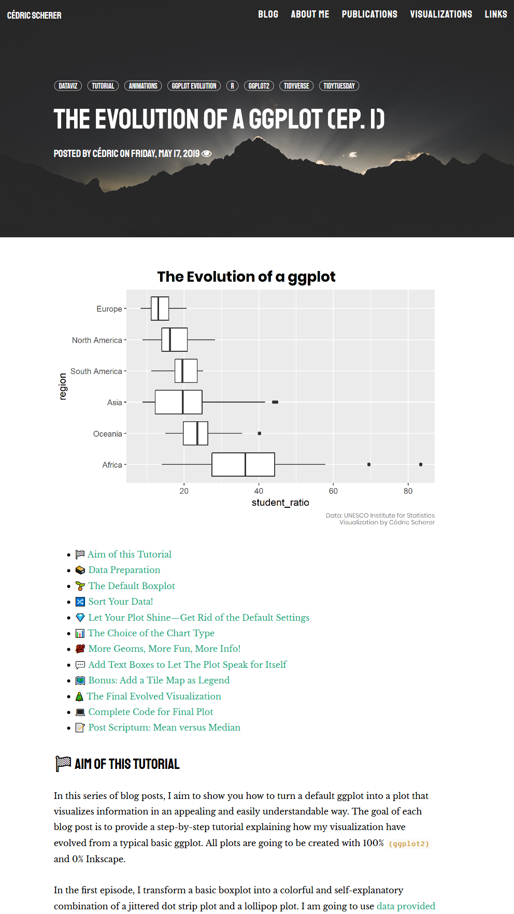</p>
]